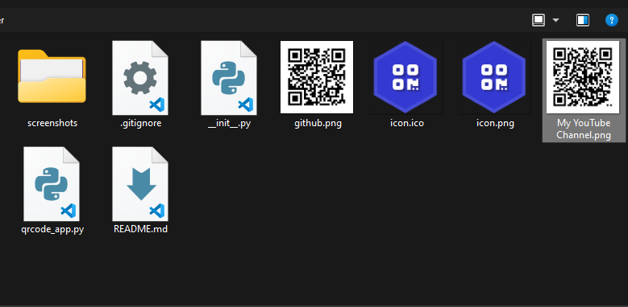

# QR Code Generator & Reader App 🔍
A basic program that can generates QR Codes from the data provided, but also can scan any QR Codes to see its information.

## How to use it ⌨️
The program has 2 tabs:

1. QR Code Generator
2. QR Code Reader

### QR Code Generator 🔧
On this tab you can generate QR Codes.

1. In the **QR Code Data**, type or paste the data that you want to convert it into a QR Code.

2. Then in the **Filename** type a name for the image.

3. The last step is to press the **Generate QR Code** Button.

4. A Confirmation window will appaer. Press Yes if you want to proceed.

5. It's done! Now you have your QR Code generated in a png file.

6. If you want to reset the app to use it again, just press the **Reset** button

7. A confirmation window will pop up, just press Yes to proceed and you will be able to make a new QR Code.

### QR Code Reader 📖
Using this tab you can scan any QRCode that you want.

1. Just press the **Browse** button and search the QR that you want to scan

2. Click open or double click to select the QR.

3. Now just press **Read QR Code**.

4. It's Done!! You can also press the **Copy to Clipboard** button to copy the information and paste it or share it.

## Free Usage
I made this basic program with educational purposes, it helps me a lot to practice my logic and programming skills.

I relied [The Pyrhon Code](https://thepythoncode.com/article/make-a-qr-code-generator-and-reader-tkinter-python) as the main guide for developing this program.

Feel free to clone this repository, modify the code and make changes.
Enjoy your coding time! ⌨️

## Convert the python file into an .exe 🐍
If you want to convert this file into a window's executable file just follow these steps:

1. Open your terminal
2. Install pyinstaller `pip install pyinstaller`
3. Select the python file named *qrcode_app.py* and the ***icon.ico*** file.

~~~
pyinstaller.exe --onefile --icon=icon.ico qrcode_app.py
~~~

4. Press ***Enter***.
5. Done! 🥳